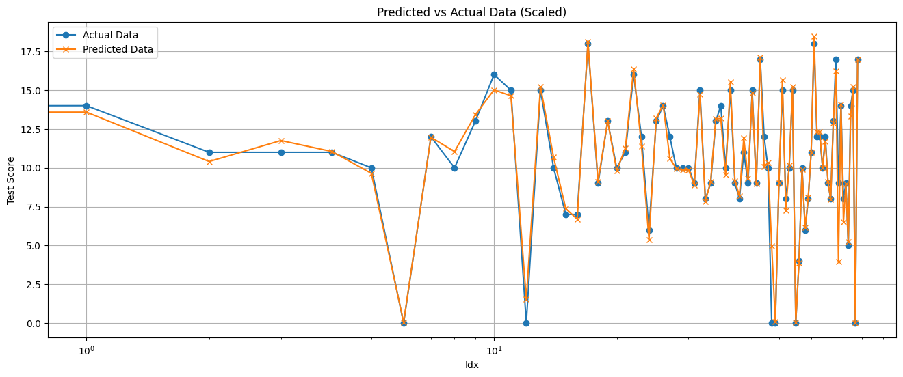

# Linear Regression & Classification

Linear regression is a fundamental statistical method used in machine learning to model the relationship between a dependent variable and one or more independent variables. It is particularly useful for predicting outcomes based on input data  

A classification algorithm in machine learning is used to categorize data into predefined classes or labels. It learns from training data with known class labels and makes predictions on new, unseen data based on learned patterns. Examples include logistic regression, decision trees, support vector machines, and neural networks. These algorithms output a class label, such as 'spam' or 'not spam,' based on the input features  

## Dataset

1. [Regression] Student Performance:  
<https://archive.ics.uci.edu/dataset/320/student+performance>
2. [Classification] Hearth Failure:  
<https://www.kaggle.com/datasets/fedesoriano/heart-failure-prediction>

## Table of Content

- [Linear Regression from scratch](./linear_regression_from_scratch.ipynb)  
- [Mathematics behind Linear Regression](./Linear-Regression-Mathematics-notes.pdf)
- [Predict Student Performance](./predict-student-performance.ipynb)
- [Binary Classify Heart Failure](./classify-heart-failure.ipynb)

## Score Prediction Graph  

